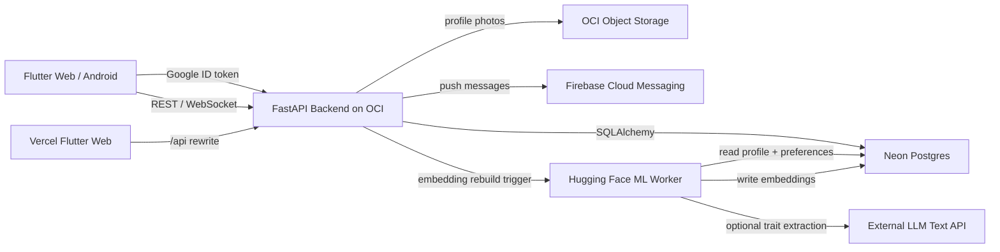

# Flinder Technical Analysis

## Executive Summary

Flinder is a production-oriented roommate and flatmate discovery platform built around a Flutter client, a Python FastAPI backend, Neon Postgres, Google OAuth, OCI deployment, and a separate ML worker for semantic matching. The core product is intentionally similar to Tinder at the interaction layer: users complete a profile, receive a ranked swipe stack, swipe right to like, swipe left to pass, and form matches when likes are mutual.

The technically distinctive part of Flinder is the matching system. Instead of relying only on exact enum matches such as "likes music" or "night owl", the backend builds semantic profile embeddings across multiple compatibility categories. This lets the system compare meaning, not only labels. A user who writes "quiet weekdays, late-night chai, tidy kitchen" can be matched with someone whose profile says "calm home, organized shared spaces, relaxed evenings" even if their literal words or selected tags do not overlap.

The current architecture keeps the main API lightweight and deployable on a small OCI VM, while heavier embedding generation runs in a separate Hugging Face Space / ML worker. This split is important because transformer embedding models are too heavy for the current always-free micro API VM.

## Technology Stack

### Frontend

- **Flutter** for Android and Web from a shared codebase.
- **Provider** for app state and auth state.
- **Google Sign-In** for v1 authentication.
- **Flutter Card Swiper / custom swipe UI** for Tinder-style left/right interactions.
- **Firebase Messaging** for Android push-notification support.
- **WebSocket client** support through `web_socket_channel`.
- **Flutter Map + latlong2** for OSM-based map and location features.
- **Google Fonts** with Plus Jakarta Sans for modern product typography.
- **Vercel** for Flutter Web hosting, with `/api/*` rewritten to the OCI backend.

### Backend

- **FastAPI** as the Python API framework.
- **SQLAlchemy ORM** for data access.
- **Pydantic schemas** for API request validation.
- **JWT auth** after Google OAuth verification.
- **Postgres on Neon** as the managed production database.
- **Docker** for backend packaging.
- **OCI Compute VM** for the production FastAPI container.
- **OCI Object Storage** for profile photo storage.
- **Firebase Admin SDK** for push delivery.
- **Nominatim / OpenStreetMap** style location workflow with database caching.

### ML / AI

- **Sentence Transformers** for embedding generation.
- Default semantic model: `all-MiniLM-L6-v2`.
- **LLM trait extraction** through an external AI text API.
- **Hugging Face Space** as a free/low-cost ML worker host.
- **Cosine similarity** for vector comparison.
- **Swipe-learning preference vectors** derived from user behavior.

## High-Level Architecture



The backend remains the source of truth for profile completion, onboarding skip state, swipes, blocks, reports, matches, chats, notifications, and embeddings. The Flutter app stores auth state locally for convenience, but refreshes the user from `/api/users/me` so important routing decisions are not local-only.

## Data Model Highlights

Flinder uses a relational schema with JSONB where flexible profile data is useful.

Important tables:

- `users`: identity, Google subject, role, account status, profile completion, onboarding skip state.
- `profiles`: roommate profile data, location, budget, lifestyle, languages, completion score.
- `preferences`: critical and non-critical matching preferences.
- `profile_pictures`: uploaded photos and primary-photo selection.
- `user_embeds`: semantic embeddings and metadata for each user.
- `swipes`: like/pass actions.
- `matches`: mutual-like relationships.
- `chats`, `chat_members`, `messages`: chat and realtime messaging state.
- `user_blocks`, `user_reports`, `flat_reports`: safety and moderation.
- `boosts`, `swipe_rewinds`: premium-feel discovery controls.
- `device_info`, `notifications`, `notification_deliveries`: push notification state.
- `geocode_cache`: cached geocoding results to avoid unnecessary external calls.

The `user_embeds` table is central to the ML feature. It stores separate vectors for:

- `embedding_hobbies`
- `embedding_interests`
- `embedding_traits`
- `embedding_personality`
- `embedding_likes`
- `embedding_dislikes`

It also stores:

- `model_name`: embedding model used.
- `source_hash`: hash of profile/preferences source data.
- `llm_traits`: extracted JSON from the LLM trait pass.
- `canonical_text`: normalized text sent to the embedding model.
- `status`: `missing`, `stale`, `ready`, or `failed`.
- `error`: failure detail if embedding generation failed.
- `last_embedded_at`: rebuild timestamp.

## Semantic Matching Pipeline

The semantic matching system turns messy human profile data into structured vector signals.

### 1. Profile and Preference Capture

The Flutter onboarding questionnaire gathers multiple formats of preference data:

- single-choice answers for room type, budget, guests, pets, move-in timing;
- sliders for distance and noise comfort;
- range sliders for preferred age range;
- multi-select chips for home vibes, deal breakers, and interests;
- free-text bio / intro.

This is important because roommate compatibility is not purely categorical. Some signals are hard filters, but many are soft, fuzzy, and semantic.

### 2. Canonical Text Construction

The backend builds canonical text for each semantic category:

- hobbies
- interests
- traits
- personality
- likes
- dislikes

The canonical text builder merges:

- profile bio;
- selected interests;
- lifestyle fields;
- generated profile descriptions;
- critical and non-critical preferences;
- LLM-extracted compatibility traits when available.

The goal is to create stable, category-specific natural-language text. This avoids embedding one giant blob and losing useful structure. A "likes" vector and a "dislikes" vector carry different matching meaning.

### 3. Optional LLM Trait Extraction

Before embedding, the ML worker can call the existing AI text API. The prompt asks the LLM to extract roommate compatibility signals as JSON:

```json
{
  "hobbies": "...",
  "interests": "...",
  "traits": "...",
  "personality": "...",
  "likes": "...",
  "dislikes": "..."
}
```

The LLM is not used for pairwise matching. That is deliberate. Pairwise LLM matching would be slower, more expensive, harder to debug, and harder to reproduce. Instead, the LLM enriches each profile once when the profile changes, and vector search/similarity handles ranking cheaply afterward.

If the LLM fails, the system falls back to raw profile and preference text. This makes semantic matching degradation-safe.

### 4. Embedding Generation

The worker uses Sentence Transformers, currently `all-MiniLM-L6-v2`, to generate normalized vectors for each category.

The model is a good v1 choice because:

- it is small compared with larger transformer encoders;
- it produces 384-dimensional embeddings;
- it is fast enough for batch rebuild jobs;
- it captures semantic closeness much better than exact keyword overlap;
- it can run on free/low-cost CPU hardware for modest traffic.

Embedding generation is triggered when profile or preference data changes:

1. Backend computes `source_hash`.
2. Existing embedding row is marked `stale` when source data changes.
3. Backend calls the ML worker with `ML_WORKER_TOKEN`.
4. Worker rebuilds vectors and writes them back to `user_embeds`.

## Matching Algorithm

Discovery is not only semantic. It combines hard filters, safety filters, practical constraints, semantic similarity, learned user behavior, and boost modifiers.

### Discovery Filtering

Before ranking, the backend removes candidates who should not appear:

- the current user;
- already-swiped users;
- blocked users;
- users who blocked the current user;
- incomplete current profiles are blocked from discovery with a 403 response.

This prevents ranking from being wasted on invalid or unsafe candidates.

### Semantic Compatibility Score

For two users with ready embeddings, the backend compares corresponding vectors using cosine similarity.

Cosine similarity:

```text
cosine(a, b) = dot(a, b) / (||a|| * ||b||)
```

The raw cosine value ranges from `-1` to `1`. Flinder normalizes it to `0..1`:

```text
normalized = (cosine + 1) / 2
```

Each semantic category has a weight:

```text
hobbies      0.10
interests    0.20
traits       0.20
personality  0.20
likes        0.15
dislikes     0.15
```

The weighted semantic score contributes up to 60 points to discovery ranking.

### Conflict Penalty

The interesting part is that Flinder does not treat every semantic overlap as good. It compares:

- current user's likes vs candidate's dislikes;
- current user's dislikes vs candidate's likes.

If these vectors are close, the system applies a conflict penalty. This matters because two people can have overlapping interests but incompatible living boundaries. For roommate matching, avoiding lifestyle conflict is as important as finding shared hobbies.

Example:

- User A likes "hosting late-night parties".
- User B dislikes "noise, late guests, loud weekends".

A pure interest overlap score might miss this. The likes/dislikes conflict penalty catches it.

### Practical Fit Score

The backend adds practical ranking points for:

- same city;
- budget overlap;
- room preference;
- shared languages;
- move-in timing;
- recent activity.

This keeps recommendations grounded. A semantically compatible profile is less useful if the budget and city do not work.

### Swipe-Learning Score

Flinder also learns from user swipes.

The swipe-learning model:

1. Looks at recent swipes for a user.
2. Loads embeddings for swiped targets.
3. Adds liked profiles' vectors positively.
4. Adds passed profiles' vectors negatively with a smaller weight.
5. Normalizes the resulting preference vector per category.
6. Scores new candidates against that learned vector.

Likes are weighted as `+1.0`.
Passes are weighted as `-0.35`.

The learned signal is activated only after enough behavioral data exists:

- at least 4 swipes;
- at least one like;
- available embeddings for swiped targets.

The learned preference signal contributes up to 15 points, scaled by confidence:

```text
confidence = min(1.0, signal_count / 30)
```

This prevents early random swipes from dominating recommendations.

### Boost Modifier

Active boosts add a visibility bonus. The current implementation adds 30 points for boosted users during discovery ranking. This creates a premium-feel feature without requiring payment infrastructure in v1.

### Final Ranking Shape

Conceptually:

```text
final_score =
    semantic_compatibility
  + learned_preference_score
  + city_fit
  + budget_fit
  + room_preference_fit
  + language_fit
  + move_in_fit
  + recent_activity
  + boost_bonus
  - semantic_conflict_penalty
```

The response includes high-level compatibility reasons and category scores for debugging/admin visibility, but not raw embeddings.

## Mathematical Formulas Used

This section collects the formulas used by the recommender and profile-quality logic. The implementation is intentionally simple enough to be explainable, while still capturing semantic and behavioral signals.

### 1. Source Hash For Embedding Freshness

Before rebuilding embeddings, the backend serializes the user's profile and preferences into a stable JSON payload and hashes it.

```text
source_hash = SHA256(json(profile, preferences, sorted_keys=true))
```

If the stored `source_hash` differs from the current hash, the embedding row is marked `stale`.

Purpose:

- avoid rebuilding embeddings when profile data has not changed;
- detect profile/preference changes cheaply;
- make worker rebuilds idempotent.

### 2. Cosine Similarity

All vector closeness is based on cosine similarity.

For two vectors `a` and `b`:

```text
dot(a, b) = sum(a_i * b_i)

||a|| = sqrt(sum(a_i^2))
||b|| = sqrt(sum(b_i^2))

cosine(a, b) = dot(a, b) / (||a|| * ||b||)
```

Range:

```text
-1 <= cosine(a, b) <= 1
```

Interpretation:

- `1`: very similar direction;
- `0`: unrelated / orthogonal;
- `-1`: opposite direction.

The implementation returns `0` if either vector is missing, empty, or mismatched in length.

### 3. Cosine Normalization

Cosine values are converted from `[-1, 1]` into `[0, 1]`.

```text
normalized_similarity = (cosine(a, b) + 1) / 2
```

This makes category scores easier to combine with weighted averages.

### 4. Semantic Category Weighted Average

Flinder does not create one generic compatibility vector. It compares separate category vectors:

```text
C = {hobbies, interests, traits, personality, likes, dislikes}
```

Current weights:

```text
w_hobbies      = 0.10
w_interests    = 0.20
w_traits       = 0.20
w_personality  = 0.20
w_likes        = 0.15
w_dislikes     = 0.15
```

For each category `c`:

```text
s_c = normalized_similarity(current.embedding_c, candidate.embedding_c)
```

Weighted semantic similarity:

```text
semantic_weighted =
    sum(w_c * s_c for c in C) / sum(w_c for c in C)
```

Because the weights sum to `1.0`, this is effectively:

```text
semantic_weighted = sum(w_c * s_c)
```

### 5. Likes/Dislikes Conflict Penalty

The recommender penalizes compatibility when one user's likes are close to the other user's dislikes.

Raw conflict components:

```text
conflict_1 = max(0, cosine(current.likes, candidate.dislikes))
conflict_2 = max(0, cosine(current.dislikes, candidate.likes))
```

Combined conflict:

```text
raw_conflict = conflict_1 + conflict_2
```

Weighted and capped conflict:

```text
conflict_penalty = min(1.0, raw_conflict * 0.18)
```

Final semantic score before point scaling:

```text
semantic_final = clamp(semantic_weighted - conflict_penalty, 0.0, 1.0)
```

Point contribution:

```text
semantic_points = round(semantic_final * 60)
```

This means semantic compatibility can contribute up to `60` ranking points.

### 6. Budget Overlap

Budget fit is treated as an interval-overlap problem.

For current user budget interval `[a_min, a_max]` and candidate interval `[b_min, b_max]`:

```text
budget_overlaps = max(a_min, b_min) <= min(a_max, b_max)
```

If true:

```text
budget_points = 12
```

Otherwise:

```text
budget_points = 0
```

### 7. Practical Fit Points

The practical score is additive.

```text
practical_points =
    city_points
  + budget_points
  + room_preference_points
  + language_points
  + move_in_timing_points
  + recent_activity_points
```

Current values:

```text
city_points             = 15 if same city else 0
budget_points           = 12 if budget intervals overlap else 0
room_preference_points  = 6  if same room preference or current preference is "any" else 0
language_points         = 5  if shared_languages is non-empty else 0
move_in_timing_points   = 4  if move-in dates match else 0
recent_activity_points  = 5  if candidate was active in the last 7 days else 0
```

### 8. Swipe-Learning Preference Vector

Swipe learning builds a user-specific preference vector from past swipes.

For every semantic category `c`, the system accumulates vectors from profiles the user has swiped on:

```text
accumulator_c = zero_vector
```

For each swipe target embedding `v_c`:

```text
if action == "like":
    accumulator_c = accumulator_c + 1.0 * v_c

if action == "pass":
    accumulator_c = accumulator_c - 0.35 * v_c
```

The pass weight is smaller than the like weight because a pass can mean many things: bad timing, weak photo, wrong city, or a temporary preference. A like is a stronger positive signal.

The accumulator is normalized:

```text
learned_vector_c = accumulator_c / ||accumulator_c||
```

If the norm is zero, the learned vector is unavailable for that category.

### 9. Swipe-Learning Activation Threshold

Swipe learning is available only when there is enough signal:

```text
signal_count = like_count + pass_count

available =
    has_vectors
    and signal_count >= 4
    and like_count > 0
```

This prevents a new user's first few random swipes from dominating ranking.

### 10. Swipe-Learning Candidate Score

For each learned category vector:

```text
learned_similarity_c =
    normalized_similarity(learned_vector_c, candidate.embedding_c)
```

Average learned similarity:

```text
learned_average =
    sum(learned_similarity_c for available categories) / category_count
```

Confidence grows with the number of swipe signals:

```text
confidence = min(1.0, signal_count / 30)
```

Maximum learning contribution:

```text
MAX_LEARNING_POINTS = 15
```

Final learned score:

```text
learned_points = round(learned_average * MAX_LEARNING_POINTS * confidence)
```

### 11. Boost Modifier

If the candidate has an active boost:

```text
boost_points = 30
```

Otherwise:

```text
boost_points = 0
```

### 12. Final Discovery Ranking Score

The implementation computes the final score as:

```text
final_score =
    semantic_points
  + learned_points
  + practical_points
  + boost_points
```

Expanded:

```text
final_score =
    round(clamp(weighted_semantic_similarity - conflict_penalty, 0, 1) * 60)
  + round(learned_average * 15 * confidence)
  + city_points
  + budget_points
  + room_preference_points
  + language_points
  + move_in_timing_points
  + recent_activity_points
  + boost_points
```

Candidates are sorted by `final_score` descending, and the API returns the top results.

### 13. Profile Completion Score

Profile completion is also score-based. The profile update endpoint computes a score out of 100.

```text
completion_score =
    bio_points
  + photo_points
  + location_points
  + budget_points
  + lifestyle_points
  + interests_points
  + preference_points
```

Current values:

```text
bio_points          = 15 if bio length >= 20 else 0
photo_points        = 20 if at least one profile photo exists else 0
location_points     = 15 if city/location exists else 0
budget_points       = 10 if budget exists else 0
lifestyle_points    = 15 if lifestyle exists else 0
interests_points    = 15 if interests exist else 0
preference_points   = 10 if room and gender preferences exist else 0
```

Profile completion flag:

```text
profile_completed = completion_score >= 70
```

Onboarding step:

```text
if completion_score >= 70:
    onboarding_step = "complete"
elif completion_score >= 45:
    onboarding_step = "preferences"
elif completion_score >= 20:
    onboarding_step = "photos"
else:
    onboarding_step = "basic"
```

Discovery is gated on a completion score of at least `70`.

## Why This Matching Design Is Unique

Most roommate apps rely on basic filters:

- city;
- budget;
- gender preference;
- move-in date;
- room type;
- a few lifestyle enums.

Flinder adds a deeper layer:

1. **Natural-language compatibility**: Free-text lifestyle descriptions can influence ranking.
2. **Category-specific embeddings**: Personality, interests, likes, and dislikes are modeled separately.
3. **Conflict-aware scoring**: The system penalizes like/dislike clashes.
4. **Behavioral learning**: Swipes gradually tune each user's recommendations.
5. **LLM enrichment without LLM ranking**: LLMs improve profile understanding, but ranking remains deterministic and cheap.
6. **Graceful fallback**: If embeddings are missing, discovery still works with practical scoring.

This hybrid model is a strong fit for roommate matching because compatibility is both practical and emotional. Users need budget/city alignment, but they also need a living rhythm that feels safe, clean, quiet/social enough, and personally compatible.

## ML Worker Architecture

The backend intentionally avoids loading Sentence Transformers inside the main OCI API container.

Reasons:

- the current OCI API VM is small;
- model imports can slow cold starts;
- PyTorch/SentenceTransformer dependencies increase image size;
- embedding generation is background work, not latency-critical request work.

The ML worker exposes protected internal endpoints:

- `GET /internal/ml/health`
- `POST /internal/ml/profiles/{user_id}/rebuild`
- `POST /internal/ml/profiles/rebuild-missing`

Authentication is handled with `X-ML-Worker-Token`.

The worker can be deployed as:

- Hugging Face Gradio Space for free/low-cost v1;
- OCI Ampere A1 worker when capacity is available;
- any future container host with enough memory for the model.

The main API triggers rebuilds asynchronously. If the worker is unavailable, the API does not fail profile updates. The row remains `stale` or `failed`, and discovery falls back to non-semantic scoring.

## Authentication and Onboarding

Flinder v1 uses Google-only auth.

Flow:

1. Flutter obtains a Google ID token.
2. Backend verifies the token against `GOOGLE_OAUTH_CLIENT_ID`.
3. Backend creates or loads the user.
4. Backend returns a JWT and serialized user.
5. Flutter stores auth state locally.
6. Flutter refreshes `/api/users/me` for durable profile and onboarding state.

Onboarding is step-based and production-oriented:

- users answer a mixed-format questionnaire;
- they can skip for now;
- skip state is stored on the backend in `profile_questionnaire_skipped_at`;
- incomplete users can enter the app, but Find shows a CTA to complete the profile;
- discovery itself remains gated until profile completion score is high enough.

This balances lower signup friction with the need for high-quality matching data.

## Realtime Chat and Notifications

The backend contains chat models and realtime support:

- `chats`
- `chat_members`
- `messages`
- WebSocket endpoint support through conversation routes;
- read state through `is_read` and `read_at`.

Notifications are represented with:

- `notifications`;
- `notification_deliveries`;
- `device_info`.

FCM is used for Android push. Notification creation is tied to match/message/status events, while delivery status is persisted separately so failures can be audited.

## Safety and Moderation

Safety is represented in the core schema, not bolted on as only UI state.

Implemented moderation primitives:

- user blocks;
- user reports;
- flat reports;
- account status;
- admin role;
- admin audit logs.

Discovery and likes enforce blocks in both directions:

- if I blocked someone, they should not appear;
- if they blocked me, they should not appear.

This is important for trust in a roommate app, where users may share sensitive location and lifestyle data.

## Location and Flats

Flinder also handles flat discovery and applications.

Flat-related capabilities:

- flat listings with rent, city, amenities, rooms, image, coordinates;
- flat applications through group chats;
- user's application history;
- reportable flat listings;
- location/geocode cache for OSM/Nominatim style lookup.

The app uses rupee-based budget UI and INR profile currency, which better matches the current target market.

## Deployment Model

### Web

Flutter Web is deployed to Vercel.

Important Vercel behavior:

- `frontend` is the project root.
- Flutter builds to `build/web`.
- `/api/*` is rewritten to the OCI backend.
- Web uses same-origin `/api` calls when built with an empty `API_BASE_URL`.

This avoids browser CORS pain for the frontend while the backend is still exposed over HTTP.

### Backend

FastAPI runs as a Docker container on OCI Compute.

Deployment script responsibilities:

- upload backend source and database migrations;
- upload `.env` without committing secrets;
- build Docker image on the VM;
- restart the container;
- expose port `8000`.

### Database

Neon Postgres is used as the production database.

The migration runner applies all SQL migrations idempotently. Migrations use `IF NOT EXISTS` patterns where possible, which makes repeated deploys safer.

### Storage

OCI Object Storage is used for profile photos. The backend validates uploads and stores URLs in `profile_pictures`.

### ML

The ML worker is deployed separately from the API, currently designed for Hugging Face Space or future OCI A1.

## API Surface Highlights

Important public endpoints:

- `POST /api/auth/google`
- `GET /api/users/me`
- `POST /api/users/me/onboarding/skip`
- `GET /api/profile/me`
- `PUT /api/profile/me`
- `POST /api/profile/photos/upload`
- `GET /api/discover`
- `POST /api/discover/swipe`
- `POST /api/discover/swipe/rewind`
- `GET /api/discover/likes`
- `POST /api/profile/boost`
- `GET /api/conversations`
- `WS /api/conversations/{id}/ws`
- `GET /api/notifications`
- `POST /api/devices`
- `POST /api/reports`
- `POST /api/blocks`

Important internal ML endpoints:

- `GET /internal/ml/health`
- `POST /internal/ml/profiles/{user_id}/rebuild`
- `POST /internal/ml/profiles/rebuild-missing`

## Testing and CI

Backend tests cover:

- health checks;
- auth guard behavior;
- admin guard behavior;
- upload auth requirements;
- semantic score behavior;
- LLM parser fallback;
- canonical text generation;
- cosine similarity;
- swipe-learning preference scoring;
- internal ML token enforcement.

Flutter tests cover:

- app shell boot;
- onboarding questionnaire rendering and mixed control types.

CI currently runs:

- Python dependency install;
- backend compile check;
- backend tests;
- Flutter dependency install;
- Flutter analyze in non-fatal warning mode;
- Flutter tests;
- Flutter web release build;
- Android debug build.

## Current Engineering Tradeoffs

### Arrays Instead of Vector Database

Embeddings are stored as Postgres arrays rather than a dedicated vector database or pgvector index. This is acceptable for v1 because:

- candidate sets are small after filters;
- ranking can happen in application code;
- Neon remains simple and low-cost;
- no paid vector infrastructure is required.

As scale grows, pgvector or an ANN service would become useful.

### LLM Extraction Is Optional

The LLM enriches profile traits but is not required for matching. This keeps the system resilient to:

- AI API downtime;
- rate limits;
- malformed LLM responses;
- higher latency.

### Main API Avoids ML Dependencies

Separating the worker adds operational complexity, but it protects the main API from memory pressure and keeps normal app actions responsive.

### HTTP Backend For Now

The backend currently runs over HTTP, with Vercel proxying frontend API calls. A proper API domain and HTTPS termination should be added before a serious public launch.

## Future Technical Improvements

Recommended next improvements:

- Add pgvector and vector indexes once user volume grows.
- Add embedding batch jobs and scheduled rebuilds for stale rows.
- Add admin-only explainability views for semantic category scores.
- Add more robust profile-photo moderation.
- Add structured logging and production error tracking.
- Add HTTPS with a real API domain.
- Add richer end-to-end tests for Google login, onboarding, photo upload, swipe, match, chat, and report/block.
- Add cold-start and latency metrics for the ML worker.
- Replace remaining hard-coded fallback image URLs in older chat/liked-you UI paths.
- Add privacy controls for hiding sensitive matching reasons from normal users.

## Conclusion

Flinder is more than a CRUD roommate finder. Its technical core is a hybrid recommender system that combines hard practical filters, semantic vector similarity, LLM-assisted trait extraction, behavior-based swipe learning, conflict penalties, and safety filters.

That combination is what makes the product interesting. It understands that roommate compatibility is not just "same city and budget"; it is also rhythm, boundaries, cleanliness, social energy, dislikes, and the subtle meaning inside how people describe the home they want.
